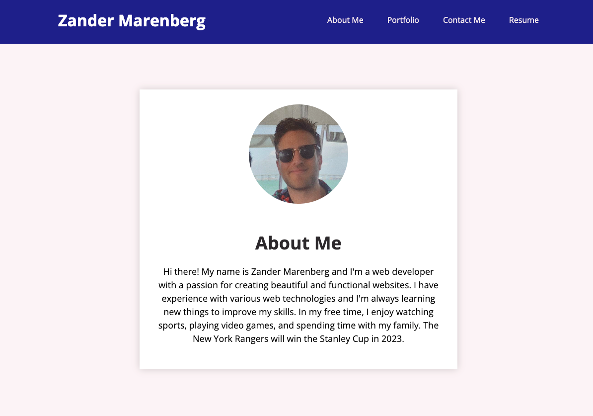

# React-Portfolio

## Description

This is a portfolio website built with React. It is a single page application that uses React Router to navigate, without the need for the page to refresh. It also uses React components, to make the page more modular and efficient.

## Links

* [Deployed Application](https://zander-m75.github.io/React-Portfolio/)
* [GitHub Repository](https://github.com/Zander-M75/React-Portfolio)

## Installation

Clone repository to your local machine. Run `npm install` to install dependencies. Run `npm start` to start the application.

## Screenshots

## Credits

React Crash Course for Beginners 2021 - Learn ReactJS from Scratch in this 100% Free Tutorial! (2021, May 5). Retrieved from https://www.youtube.com/watch?v=Dorf8i6lCuk&ab_channel=Academind

